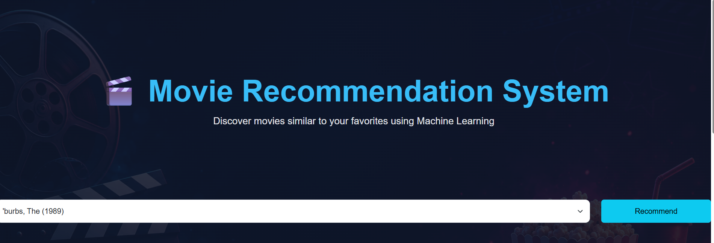
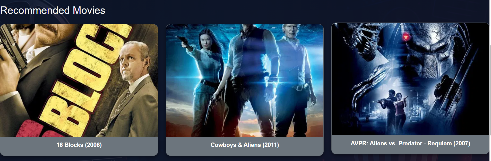

# 🎬 Movie Recommendation System


A Machine Learning based Movie Recommendation System built using **Flask**, **Collaborative Filtering**, and **TMDB API**. The system recommends movies similar to the user's selected movie and displays movie posters fetched dynamically from TMDB.

---

## 📌 Features

* 🎥 Movie Recommendation using Collaborative Filtering
* 🖼️ Real-time Movie Posters using TMDB API
* 🎨 Responsive and Modern UI
* ⚡ Fast Recommendation Generation
* 🔍 Large Movie Database Support
* ☁️ Model Files Stored Externally (Google Drive)
* 📱 Mobile-Friendly Design

---

## 📸 Project Screenshots

### Home Page



### Recommendation Results



---

## 🎬 Demo Video

Watch the project demo here:

[▶️ Watch Demo Video](https://drive.google.com/file/d/185sab40YGHf7RNZOG9V7SLxcqg06xTZA/view?usp=sharing)
---

## 🛠️ Tech Stack

### Frontend

* HTML5
* CSS3
* Bootstrap 5

### Backend

* Flask
* Python

### Machine Learning

* Pandas
* NumPy
* Scikit-Learn
* Cosine Similarity

### APIs

* TMDB API

---

## 📂 Project Structure

```text
Movie_Recommendation/
│
├── app.py
├── requirements.txt
├── README.md
├── .gitignore
│
├── dataset/
│   ├── movies.csv
│   └── links.csv
│
├── templates/
│   └── index.html
│
├── static/
│   ├── style.css
│   ├── background.png
│   └── no-poster.png
│
└── screenshots/
    ├── homepage.png
    └── recommendations.png
```

---

## 🤖 Machine Learning Approach

This project uses **Item-Based Collaborative Filtering**.

### Workflow

1. Load MovieLens Dataset
2. Merge Movies and Ratings
3. Create User-Movie Matrix
4. Fill Missing Values with 0
5. Compute Cosine Similarity
6. Store Similarity Matrix
7. Recommend Top Similar Movies

### Algorithm Used

```python
Cosine Similarity
```

The recommendation engine identifies movies that have similar user-rating patterns.

---

## 💾 Large Model File Handling

GitHub does not allow files larger than 100 MB.

Therefore the following files are stored externally in Google Drive:

```text
movie_pivot.pkl
similarity.pkl
```

These files are downloaded automatically when the application starts.

### Google Drive Storage

| File            | Storage      |
| --------------- | ------------ |
| movie_pivot.pkl | Google Drive |
| similarity.pkl  | Google Drive |

The application checks if the files exist locally.

If not found:

```python
Download from Google Drive
↓
Save Locally
↓
Load Model
```

This keeps the GitHub repository lightweight and deployment-friendly.

---

## 🚀 Installation

### Clone Repository

```bash
git clone https://github.com/dassoumitra/movie-recommendation-system.git

cd movie-recommendation-system
```

### Install Dependencies

```bash
pip install -r requirements.txt
```

### Run Application

```bash
python app.py
```

Open:

```text
http://127.0.0.1:5000
```

---

## 🔑 TMDB API Setup

Get a free API key from:

https://www.themoviedb.org/settings/api

Update:

```python
API_KEY = "YOUR_TMDB_API_KEY"
```

in `app.py`

---

## 🌐 Deployment

The project can be deployed on:

* PythonAnywhere
* Render
* Railway
* VPS Hosting

### Deployment Notes

Large model files are stored in Google Drive and downloaded automatically at runtime.

This avoids GitHub file-size limitations.

---

## 📈 Future Improvements

* User Authentication
* Search Suggestions
* Genre-Based Filtering
* Trending Movies Section
* Top Rated Movies
* User Ratings Storage
* Hybrid Recommendation System
* Deep Learning Based Recommendations

---

## 👨‍💻 Author

**Soumitra Das**

GitHub:
https://github.com/dassoumitra

LinkedIn:
Add your LinkedIn Profile Link

---

## 🙏 Acknowledgements

* MovieLens Dataset
* TMDB API
* Flask Community
* Scikit-Learn
* Bootstrap

---

## ⭐ Support

If you like this project, consider giving it a ⭐ on GitHub.

It helps others discover the project and motivates future improvements.
